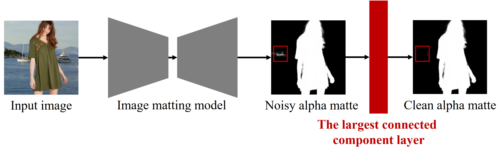
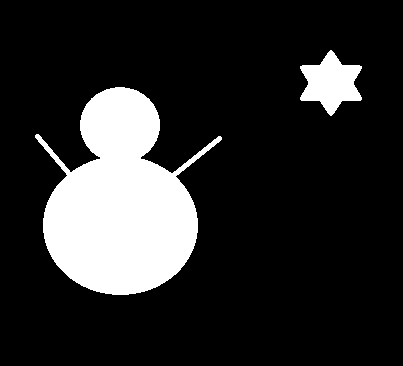
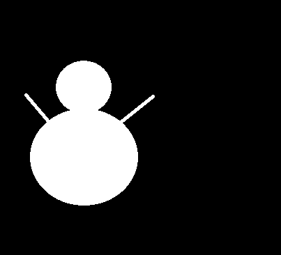

# Differentiable Largest Connected Component (LCC) Layer

Official implementation of the ICANN 2024 paper [Differentiable Largest Connected Component Layer for Image Matting](https://link.springer.com/chapter/10.1007/978-3-031-72332-2_27). 

<p align="middle">
    
</p>

## Installation
Please install the LCC layer as follows.
```
python setup.py build_ext --inplace
```

## How to Use the Code
Original alpha matte | Processed alpha matte
--- | ---
 | 

This can be achieved by running
```
python example.py
```

## Future Work
By processing the mask of each channel, the LCC layer can be simply applied to other tasks, e.g., semantic segmentation.

## Citation
If you find our code or paper helps, please consider citing:
```
@InProceedings{10.1007/978-3-031-72332-2_27,
    author="Liu, Xinshuang
    and Zhao, Yue",
    editor="Wand, Michael
    and Malinovsk{\'a}, Krist{\'i}na
    and Schmidhuber, J{\"u}rgen
    and Tetko, Igor V.",
    title="Differentiable Largest Connected Component Layer for Image Matting",
    booktitle="Artificial Neural Networks and Machine Learning -- ICANN 2024",
    year="2024",
    publisher="Springer Nature Switzerland",
    address="Cham",
    pages="419--431",
    isbn="978-3-031-72332-2"
}
```
