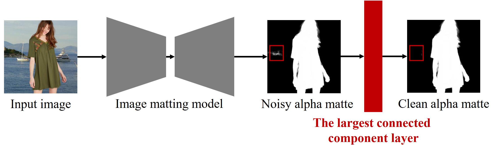

# Differentiable Largest Connected Component (LCC) Layer

Official implementation of the ICANN 2024 paper Differentiable Largest Connected Component Layer for Image Matting. 

<p align="middle">
    
</p>

## Installation
Please install the LCC layer as follows.
```bash
python setup.py build_ext --inplace
```
If you just want to use the LCC layer, only these four files are needed:
- gpu_layers.py
- lcc_cuda_kernel.cu
- lcc_cuda.cpp
- gpu_layers.py

## Using the LCC Layer for Image Matting

By processing the mask of each channel, the LCC layer can be simply applied to other tasks, e.g., semantic segmentation.

### Data Preparation
Please organize the datasets as follows.

    ../                         # parent directory
    ├── ./                      # current (project) directory
    ├── AMD/                    # the dataset
    │   ├── train/
    │   │   ├── fg/
    │   │   └── alpha/
    │   └── test/           
    │       ├── merged/
    │       └── alpha_copy/
    ├── ...

### Train
- Use the LCC layer during training

    `python train.py --dataset [dataset_name] --LCC`

- Otherwise

    `python train.py --dataset [dataset_name]`

### Test
- Use the LCC layer during training

    `python test.py --dataset [dataset_name] --LCC`

- Otherwise

    `python test.py --dataset [dataset_name]`


## Acknowledgement
Thanks to the code base from [GCA-Matting](https://github.com/Yaoyi-Li/GCA-Matting), [MODNet](https://github.com/ZHKKKe/MODNet)
